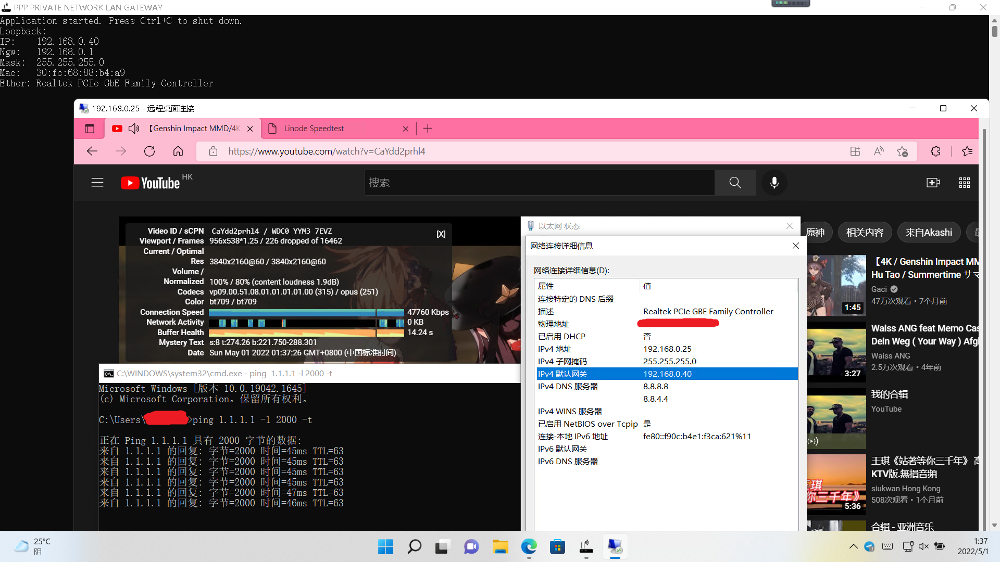
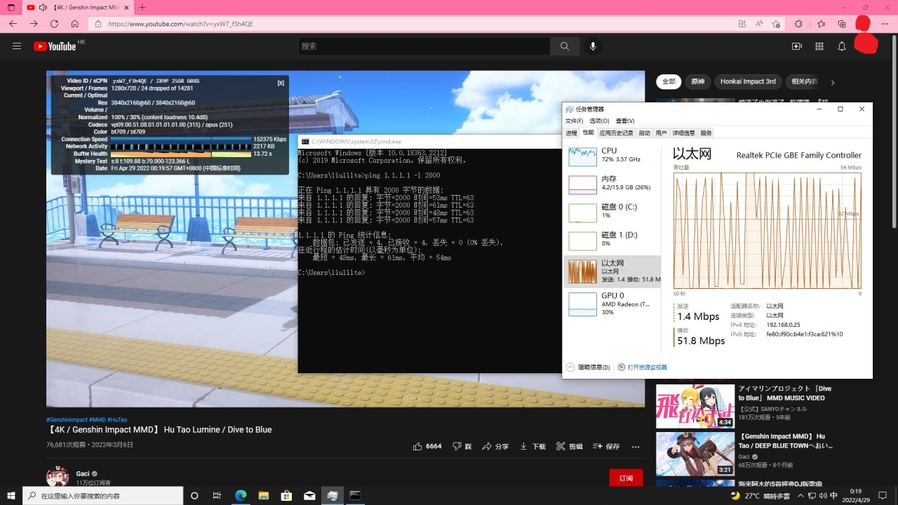

# VGW-releasse
##### Linux/Windows Software Router: VGW is SD-ROUTER, Provides optional access gateways for lans #####
##### Linux/Windows 软件路由器，为局域网提供可选接入网关 #####

## Features: ##
> 1. IP Fragement Transmit Support. [IP分片传送支持]
> 2. TCP/UDP/ICMP Transmit Support. [TCP/UDP/ICMP传送支持]
> 3. Only IPv4. [只IPV4]
> 4. Compatible with tun2socks and other forms of VPN network. [兼容 tun2socks 与任何VPN网络]
> 5. Overlapping Kernel-ip route and next Hops. [重叠内核IP路由及跃点]
> 6. Overlapping Multiple-Networks. [重叠多重网络]
> 7. LAN Default Gateway Route server. [局域网默认网关路由服务器]
> 8. Ethernet bridge. [以太网桥接]
> 9. Perfect compatibility with WinSPI global agents such as "PaperAirplane TCP/IP NSP/LSP". [完美兼容WinSPI全局代理，例如“PaperAirplane TCP/IP NSP/LSP”]
> 10. Easy to user configure used. [易于用户配置使用]

## Usage: ##
### Windows ####
> 1. .\vgw.exe --ip=192.168.0.40 --ngw=192.168.0.1 --mask=255.255.255.0
> 2. .\vgw.exe --ip=192.168.0.40 --ngw=192.168.0.1 --mask=255.255.255.0 --mac=30:fc:68:88:b4:a9

### Linux ####
> 1. ./vgw --ip=192.168.0.40 --ngw=192.168.0.1 --mask=255.255.255.0
> 2. ./vgw --ip=192.168.0.40 --ngw=192.168.0.1 --mask=255.255.255.0 --mac=30:fc:68:88:b4:a9

## Command-Argument ##
> 1. --ip=VGW bridge IP address, which is the Gateway server IP address. [VGW网关IP地址，即网关服务器的IP地址]
> 2. --ngw=Default gateway IP address of the next hop. [下一跳默认网关地址]
> 3. --mask=Net-mask of the next hop gateway. [下一跳网关掩码地址]
> 4. --mac=MAC address used by the VGW, default: 30:fc:68:88:b4:a9. [VGW网关MAC地址，MAC缺省地址: 30:fc:68:88:b4:a9]

## Demo Screenshots ##

